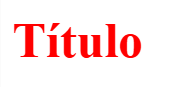
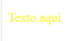
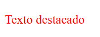
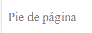

**TALLER DE ESPECIFICIDAD**
Mediante la elaboración de este trabajo se busca comprender la funcionalidad de especificidad en CSS.

1. **Parte 1: Introducción teórica a la especificidad**
    En esta se evaluaron conceptos claves en la temática tales como: especificidad, tipos de selectores, valores de especificidad según el tipo de selector y la regla (!important). Por lo que se realizaron las siguientes diapositivas https://docs.google.com/presentation/d/13HzbAxWkbOnRjkP3V984eZFZycE4HkbM9XCv9y4pkU8/edit?usp=sharing

2. **Parte 2: Ejemplos Prácticos**
    En el primer ejercicio básico se reconoció la prevalencia en la aplicación de las reglas de estilo según el tipo de selector, como lo muestra el ejemplo a continuación:

        

            
Hola Mundo

        

    Según lo anterior, se aplicaron algunas reglas de estilo las cuales fueron:

        /*Parte 2 */
        p {
            color: blue; /* Valor de especificidad 1 por el tipo de selector elemento */
        }

        .container p {
            color: green; /* Especificidad = 11 (10 tipo de selector clase + 1 tipo de selector elemento)  */
        }

        #parrafo {
            color: red; /* Especificidad 100 por el tipo de selector ID, el cual tiene prioridad sobre los anteriores.*/
        }

    Por lo que, obtuvimos como resultado el texto en color ROJO al tener mayor valor de especificidad el ID parrafo. 
    
    
    En el segundo ejercicio, hicimos uso de la regla !important de está manera:

        /*Parte 2 */
        p {
            color: blue !important; /*Al añadir !important no se tiene en cuenta el valor de especificidad, teniendo prevalencia esta regla de estilo */
        }

        #parrafo {
            color: red; /* Especificidad 100 por el tipo de selector ID, el cual tiene prioridad sobre los anteriores. Aunque la especificidad se ve afectada al encontrar un !important el cual da prioridad al tipo de selector elemento*/
        }

    Teniendo como resultado el texto AZUL pues la regla !important da prevalencia al selector elemento. 
    

3. **Parte 3: Calculando Especificidad**
    Posteriormente se desarrolló en siguiente contenedor:

        

            <h1>Título</h1>
            
Este es un párrafo

        

    Al cual, se le aplicaron las siguiente reglas de estilo:

        h1 {
            color: blue; /*Especificidad = 1, tipo de selector elemento */
        }

        .content h1 {
            color: green; /*Especificidad = 11, tipo de selector clase + elemento */
        }

        #main h1 {
            color: red; /*Especificidad = 101, tipo de selector ID + elemento */
        }
    Como se menciona en cada línea el valor de especificidad varía según el tipo de selector que se use para determinar la regla de estilo, en este caso la regla de estilo que tiene superioridad es **#main h1** al sumar #main como un selector tipo ID (100) y a h1 selector tipo elemnto (1).
    

    En el segundo ejercicio, se nos entregó el siguiente código:

        

            
Texto aquí

        
 

        #box p {
            color: blue;
        }
        .content .text {
            color: green;
        }

    Por lo que el "Texto Aquí" era de color azul al tener una especificidad igual a 101, se tenia que modificar el código de tal manera que el texto fuera amarillo, esto sin hacer uso de !important, el resultado fue este:
        #box .text {
            color: yellow;
        }
    Teniendo una especificidad de 110, al ser box un ID (100) + .text una clase (10). 

4. **Parte 4: Desafio Final**
    Desafío: Diseñando una Página Completa con Estilos Conflictivos
    Para la elaboración de está última parte se nos entregó el siguiente código:

        

        <h1>Bienvenido</h1>
        
Este es el sitio web.

        

        

        <h2>Contenido principal</h2>
        
Texto destacado

        

        <footer id="footer">
        
Pie de página

        </footer>
    Con el cual se debían aplicar reglas de estilo basandonos en los siguientes requerimientos:
    a. El h1 en el .header debe ser de color blanco.
        #top h1 {
        color: white;
        background-color: black;
        max-width: max-content;
    }
    Especificidad de 101, se adicionó el background-color para una mejor visualización del resultado. 

    b. El texto del p en .content debe ser rojo.
        .contentDes .highlight {
            color: red;
        }
    Especificidad de 20, al tener dos tipo de selectores clases cada uno con 10.
    

    c. El texto del footer debe ser gris.
        #footer p {
            color: grey;
        }
    Especificidad de 101, al tener ID (100) + elemento p (1).
    

